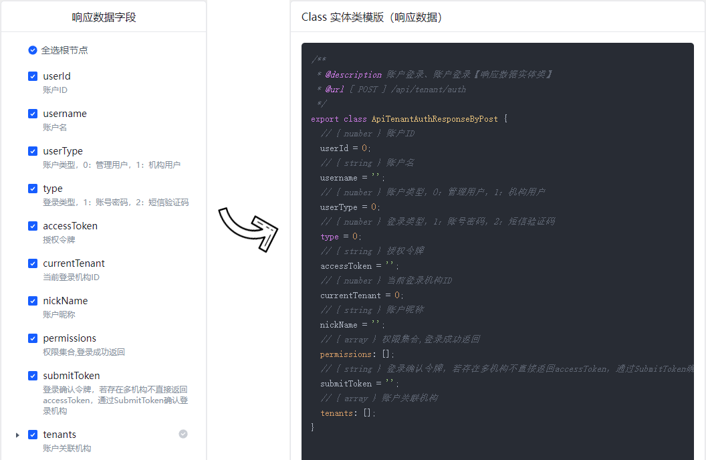

<h1
    style="background: -webkit-linear-gradient(315deg, rgb(255,87,34) 0%, #fee140 100%);
    background-clip: text;
    -webkit-background-clip: text;
    -webkit-text-fill-color: transparent"
>
    <a href="https://github.com/ztz2/api-helper" target="_blank">
        API Helper
    </a>
</h1>

    

`API Helper`，帮助开发者生成interface、类、对象、form表单模板等各种代码的工具。

> 一个用于构建 Web API 、代码模板的多功能工具库

- 💪 基于Typescript构建
- ⚙️ 单元测试
- 📦 本地部署
- 🔌 Extensible

> API生成特点
- 支持多个API项目（依赖多个API项目，一次性生成API）
- 自定义解析扩展（支持自定义解析，不限制文档类型，更好的功能扩展）
- 请求参数兼容（对象和数组参数的兼容）

## 文档
### 生成前端请求接口函数和TS类型申明
生成代码展示，[查看这里文档](./cli/README.md)

## 展示

### 基于API的代码生成器
生成代码展示，[查看这里文档](./server/README.md)

## 许可
[MIT](https://opensource.org/licenses/MIT)

Copyright (c) 2023-present, [ztz2](https://github.com/ztz2)
