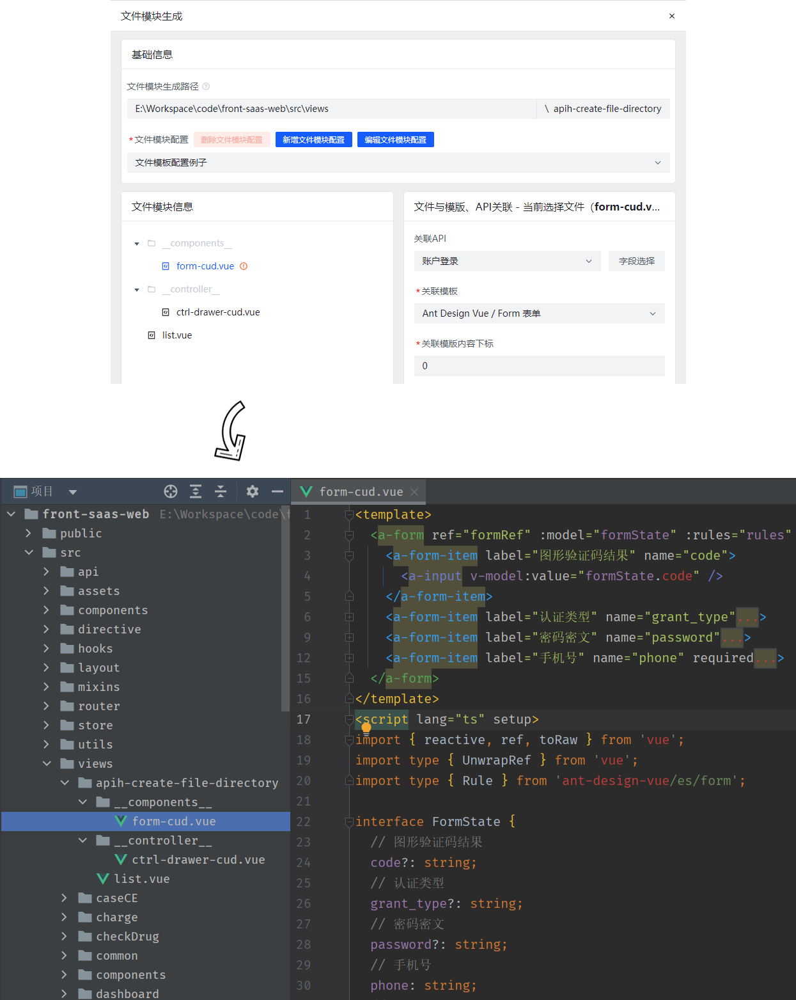

<h1
    style="background: -webkit-linear-gradient(315deg, rgb(255,87,34) 0%, #fee140 100%);
    background-clip: text;
    -webkit-background-clip: text;
    -webkit-text-fill-color: transparent"
>
    <a href="https://github.com/ztz2/api-helper" target="_blank">
        API Helper
    </a>
</h1>

    

`API Helper`，帮助开发者生成interface、类、对象、form表单模板等各种代码的工具。

> 一个用于构建 Web API 、代码模板的多功能工具库

- 🎉️ 支持swagger2和swagger3 、yapi 文档，自定义文档解析
- 💪 基于Typescript构建
- ⚙️ 单元测试
- 📦 本地部署

## 文档

### 生成前端请求接口函数和TS类型申明

API生成代码展示，[查看这里文档](./packages/cli/README.md)

### 基于API的代码生成器

代码生成器，生成代码展示，该功能需本地部署服务，[查看这里文档](./packages/server/README.md)

## 许可

[MIT](https://opensource.org/licenses/MIT) Copyright (c) 2023-present, [ztz2](https://github.com/ztz2)
