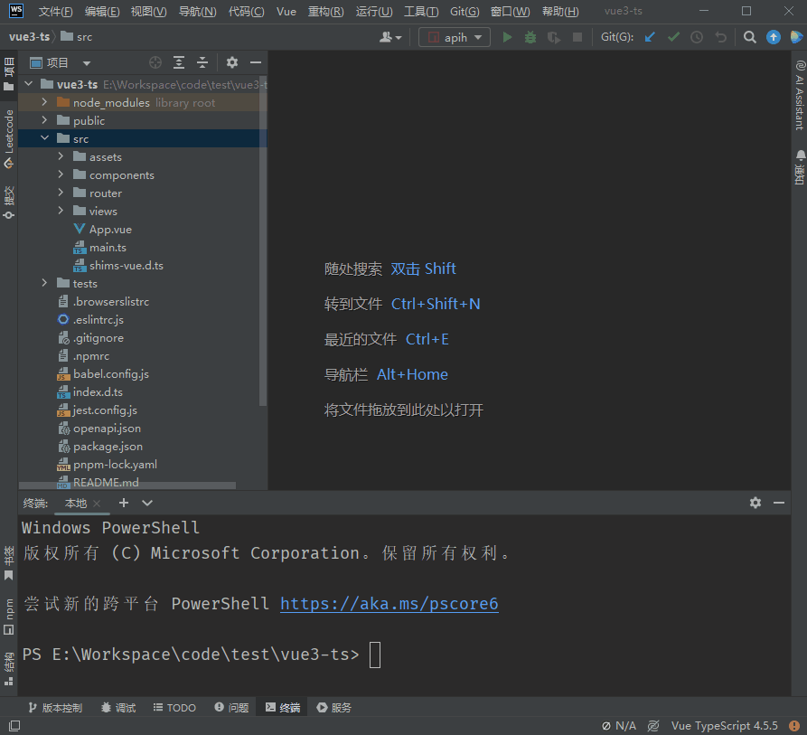
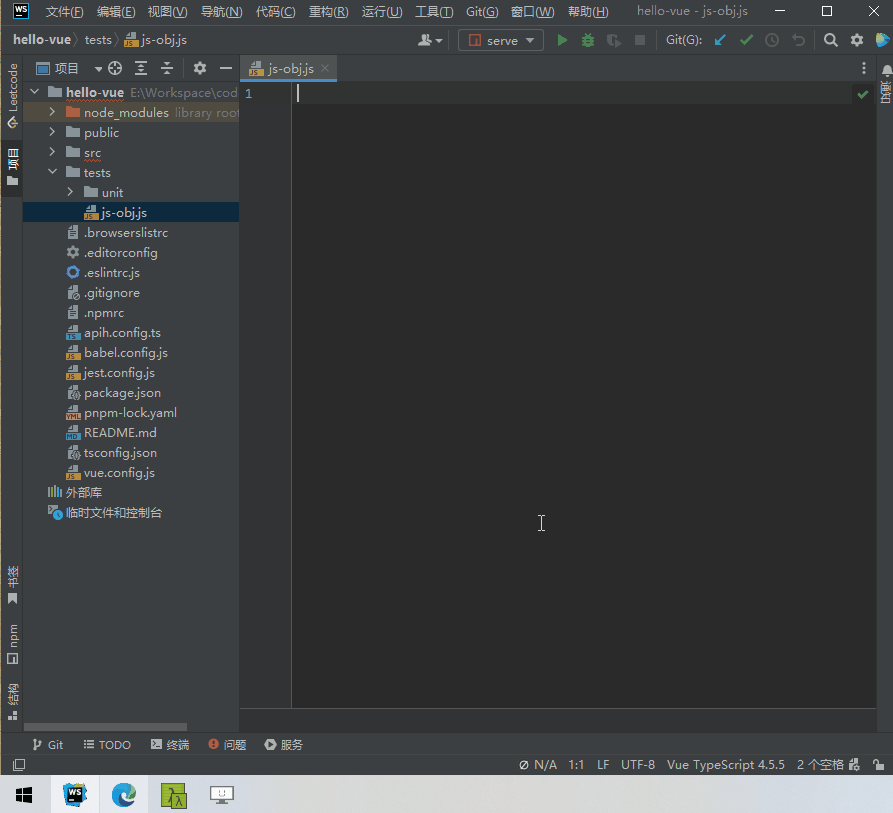

<div align="center">
  <a href="https://github.com/ztz2/api-helper" target="_blank">
    
  </a>
</div>
<div align="center">
  <h1>API Helper</h1>
</div>

<div align="center">

帮助开发者生成interface、类、对象、form表单模板等各种代码的工具。

[](https://github.com/ztz2/api-helper/blob/main/LICENSE)

</div>

<div align="center">

[English](./README.md) | 简体中文 

</div>

> 一个用于构建 Web API 、代码模板的多功能工具库

- 🎉️ 支持 openapi2 、openapi3.0 、openapi3.1、yapi 接口文档以及自定义接口文档解析
- 💪 基于Typescript构建
- ⚙️ 单元测试
- 💻 本地部署

## 📄 API生成

### 安装
```sh
$ pnpm i @api-helper/cli
# or
$ npm i @api-helper/cli
# or
$ yarn add @api-helper/cli
```

### 使用CLI方式


#### 例子
```sh
$ npx apih -u https://接口文档.com/swagger-ui.html
# or
$ npx apih -u ./local-openapi.json
```

#### CLI 配置说明
```sh
Usage: apih [options]
Options:
  -u, --url <string> 接口文档地址【当type为'swagger'类型时，可以读取本地文件，这里就可以一个本地文件路径】
  -o, --output-path <path> 代码生成后的输出路径
  --target <string> 生成的目标代码类型，默认: typescript
  --type <string> 文档类型，根据文档类型，调用内置的解析器，默认值: 'swagger'
  --auth-token <string> 访问文档可能需要认证信息，通过使用token访问，yapi的验证token
```


### 使用配置文件【推荐】


#### 初始化配置文件
输入下面指令，初始化配置文件
```sh
$ npx apih init
```

指令说明
```sh
Usage: apih init [options]
Options:
  -c, --config-path <path> 自定义配置文件的路径
```

#### 运行生成API

* 打开 **apih.config.js** 或 **apih.config.ts** 文件进行配置。
* 完成配置之后，输入下面指令，即可生成API。

```sh
$ npx apih 
```

指令说明
```sh
Usage: apih [options]
Options:
  -c, --config-path <path> 自定义配置文件的路径
```

#### apih.config 配置文件说明
```typescript
import type { Config } from '@api-helper/cli';
import { defineConfig } from '@api-helper/cli';
```
defineConfig 接收一个`Config` 对象或者`Config[]`，当需要生成多个API文件的时候，可以使用数组方式，以下文档时对Config对象的补充说明文档。

```typescript
import { defineConfig } from '@api-helper/cli';

export default defineConfig({
  // 使用分组功能，启用该功能后，按照分组多文件代码生成
  group: false,
  // 是否只生成接口请求数据和返回数据的 TypeScript 类型。是，则请求文件和请求函数都不会生成。
  onlyTyping: false,
  // 代码生成后的输出路径
  outputPath: 'src/api/index.ts',
  // 生成的目标代码类型。默认: typescript
  target: 'typescript',
  // request请求工具函数文件路径。
  requestFunctionFilePath: 'src/api/request.ts',
  // 请求数据所有字段设置成必有属性，默认: false
  requiredRequestField: false,
  // 响应数据所有字段设置成必有属性，默认：true
  requiredResponseField: true,
  // 接口文档服务配置
  documentServers: [{
    // 文档地址【当type为'swagger'类型时，可以读取本地文件，这里就可以一个本地文件路径】
    url: 'https://接口文档.com/swagger-ui.html',
    // 文档类型，根据文档类型，调用内置的解析器，默认值: 'swagger'【内置yapi和swagger的解析，其他文档类型，添加parserPlugins自行实现文档解析】
    type: 'swagger',
    // 当前接口文档服务名称，有值的情况下，文件输出变成 -> 路径/当前name
    name: '',
    // 获取响应数据的key，body[dataKey]
    dataKey: '',
    // 访问文档可能需要认证信息，http auth 验证方式
    auth: {
      username: '',
      password: '',
    },
    // 访问文档可能需要认证信息，通过使用token访问，yapi的验证token
    authToken: '',
    // 访问接口文档时候，自定义的一些请求头
    headers: {},
    // 执行过程的钩子事件
    events: {
      // 当生成interface名称时候事件回调，返回值作为新的InterfaceName，用于自定义InterfaceName
      // onRenderInterfaceName(api, options) {},
      // 当生成API名称时候事件回调，返回值作为新的RequestFunctionName，用于自定义RequestFunctionName
      // onRenderRequestFunctionName(api, options) {},
    },
  }],
  // 解析扩展插件，用于自定义解析
  parserPlugins: [],
});

```

## 📦 WEB服务

WEB服务提供了基于接口的自定义代码生成，提供了前端操作页面，使得代码生成更加方便。
* WEB服务功能的应用场景在于，重复性的表单或者表格页面，根据接口生成统一的代码模板。
* WEB服务功能本质上就是一个B/S架构的产物，需自行本地部署。
  * 浏览器端代码在web包下。
  * 服务器端代码在server包下。

### 部署说明
windows环境，请先安装 `pnpm`，然后双击运行 **run-web-server.bat** 文件即可。下面是手动部署。

#### 拉取项目代码
下载或者使用git拉取整个项目代码
```sh
git clone https://github.com/ztz2/api-helper.git
```
#### Docker 部署【推荐】
##### 镜像构建
###### 使用Dockerfile构建
```sh
docker build -t api_helper/server .
```
###### Docker compose 构建
```sh
docker compose build
```
##### 运行服务
###### 基于Dockerfile构建的运行
```shell
docker run -d -p 3210:3210 api_helper/server
```
###### 基于Docker compose构建的运行
```shell
docker-compose up -d
```

#### 手动命令部署
* 构建前端服务，进入web包下，输入命令：`pnpm run build`。
* 构建后端服务，进入server包下，输入命令：`pnpm run build`。
* 启动服务，进入server包下，输入命令：`pnpm run start:prod`。
* 服务启动后访问地址：[http://localhost:3210](http://localhost:3210)。





## 👏赞助商
<a href="https://www.jetbrains.com" target="_blank">
  
</a>

感谢 [JetBrains](https://www.jetbrains.com) 对本项目的支持。

## 📃开源许可

[MIT](https://github.com/ztz2/api-helper/blob/main/LICENSE) Copyright (c) 2023-present, [ztz2](https://github.com/ztz2)
