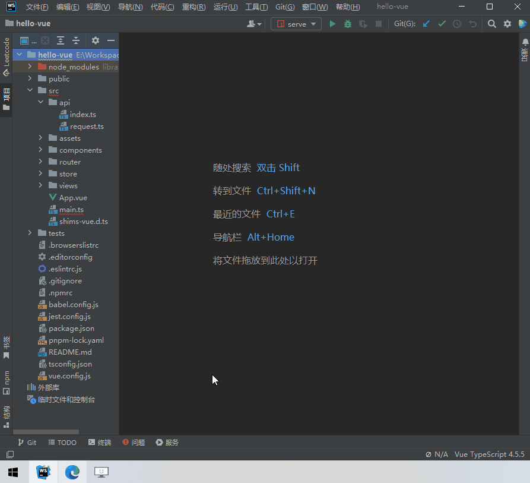

<h1
    style="background: -webkit-linear-gradient(315deg, rgb(255,87,34) 0%, #fee140 100%);
    background-clip: text;
    -webkit-background-clip: text;
    -webkit-text-fill-color: transparent"
>
    <a href="https://github.com/ztz2/api-helper" target="_blank">
        API Helper
    </a>
</h1>
<p>
    <a href="https://www.npmjs.com/org/api-helper">
        
    </a>
</p>

`API Helper Cli`，解析API文档，生成整个项目的API请求代码，请求参数响应数据TS类型申明。

> API生成特点
- 支持多个API项目（依赖多个API项目，一次性生成API）
- 自定义解析扩展（支持自定义解析，不限制文档类型，更好的功能扩展）
- 请求参数兼容（对象和数组参数的兼容）


## 安装
```shell
pnpm install @api-helper/cli
```

## 使用CLI


### 例子
```sh
$ npx apih -u http://接口文档地址.com
# or
$ npx apih -u ./local-openapi.json
```

### CLI 配置说明
指令说明
```sh
Usage: apih [options]
Options:
  -u, --url <string> 接口文档地址【当type为'swagger'类型时，可以读取本地文件，这里就可以一个本地文件路径】
  -o, --output-path <path> 代码生成后的输出路径
  --target <string> 生成的目标代码类型，默认: typescript
  --type <string> 文档类型，根据文档类型，调用内置的解析器，默认值: 'swagger'
  --auth-token <string> 访问文档可能需要认证信息，通过使用token访问，yapi的验证token
```


## 使用配置文件



### 初始化配置
输入下面指令，初始化配置
```sh
$ npx apih init
```

指令说明
```sh
Usage: apih init [options]
Options:
  -c, --config-path <path> 自定义配置文件的路径
```

### 运行生成API

* 打开 **apih.config.ts** 或 **apih.config.ts** 文件进行配置。
* 完成配置之后，输入下面指令，即可生成API。

```sh
$ npx apih 
```

指令说明
```sh
Usage: apih [options]
Options:
  -c, --config-path <path> 自定义配置文件的路径
```

### apih.config 配置文件说明
```typescript
import type { Config } from '@api-helper/cli';
import { defineConfig } from '@api-helper/cli';
```
defineConfig 接收一个`Config` 对象或者`Config[]`，当需要生成多个API文件的时候，可以使用数组方式，以下文档时对Config对象的补充说明文档。

```typescript
import { defineConfig } from '@api-helper/cli';

export default defineConfig({
  // 使用分组功能，启用该功能后，按照分组多文件代码生成
  group: false,
  // 是否只生成接口请求数据和返回数据的 TypeScript 类型。是，则请求文件和请求函数都不会生成。
  onlyTyping: false,
  // 代码生成后的输出路径
  outputPath: 'src/api/index.ts',
  // 生成的目标代码类型。默认: typescript
  target: 'typescript',
  // request请求工具函数文件路径。
  requestFunctionFilePath: 'src/api/request.ts',
  // 请求数据所有字段设置成必有属性，默认: false
  requiredRequestField: false,
  // 响应数据所有字段设置成必有属性，默认：true
  requiredResponseField: true,
  // 接口文档服务配置
  documentServers: [{
    // 文档地址【当下面的type为'swagger'类型时，可以读取本地文件，这里就可以一个本地文件路径】
    url: 'http://接口文档地址.com',
    // 文档类型，根据文档类型，调用内置的解析器，默认值: 'swagger'【内置yapi和swagger的解析，其他文档类型，添加parserPlugins自行实现文档解析】
    type: 'swagger',
    // 当前接口文档服务名称，有值的情况下，文件输出变成 -> 路径/当前name
    name: '',
    // 获取响应数据的key，body[dataKey]
    dataKey: '',
    // 访问文档可能需要认证信息，http auth 验证方式
    auth: {
      username: '',
      password: '',
    },
    // 访问文档可能需要认证信息，通过使用token访问，yapi的验证token
    authToken: '',
    // 访问接口文档时候，自定义的一些请求头
    headers: {},
    // 执行过程的钩子事件
    events: {
      // 当生成interface名称时候事件回调，返回值作为新的InterfaceName，用于自定义InterfaceName
      // onRenderInterfaceName(api, options) {},
      // 当生成API名称时候事件回调，返回值作为新的RequestFunctionName，用于自定义RequestFunctionName
      // onRenderRequestFunctionName(api, options) {},
    },
  }],
  // 解析扩展插件，用于自定义解析
  parserPlugins: [],
});

```

## 👏赞助商
<a href="https://www.jetbrains.com" target="_blank">
  
</a>

感谢 [JetBrains](https://www.jetbrains.com) 对本项目的支持。

## 📃开源许可

[MIT](https://opensource.org/licenses/MIT) Copyright (c) 2023-present, [ztz2](https://github.com/ztz2)
