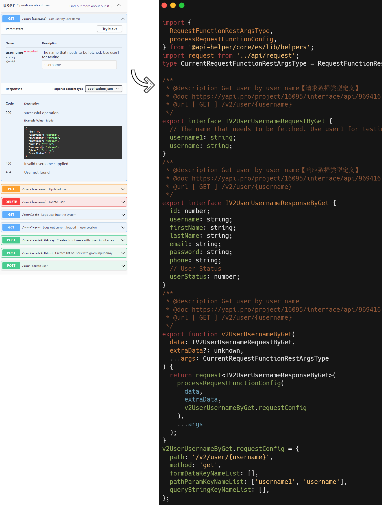

<h1
    style="background: -webkit-linear-gradient(315deg, rgb(255,87,34) 0%, #fee140 100%);
    background-clip: text;
    -webkit-background-clip: text;
    -webkit-text-fill-color: transparent"
>
    <a href="https://github.com/ztz2/api-helper" target="_blank">
        API Helper
    </a>
</h1>
<p>
    <a href="https://www.npmjs.com/org/api-helper">
        
    </a>
</p>

`API Helper Cli`，解析API文档，生成整个项目的API请求代码，请求参数响应数据TS类型申明。

> API生成特点
- 支持多个API项目（依赖多个API项目，一次性生成API）
- 自定义解析扩展（支持自定义解析，不限制文档类型，更好的功能扩展）
- 请求参数兼容（对象和数组参数的兼容）



## 安装
```shell
pnpm install @api-helper/core @api-helper/cli
```

## 开始
快速开始，只需要两步步即可。

### 步骤一
初始化配置文件，终端输入`npx apih init`命令。初始化完成后，会自动创建`apih.config.(ts|js)`配置文件和`src/api/request.(ts|js)`统一接口请求文件。
* 在生成的`apih.config.(ts|js)`配置文件中找到`documentServers.url`属性，填写**项目文档地址**。
```javascript
import { join } from 'path';
import { defineConfig } from '@api-helper/cli';

export default defineConfig({
  // 输出信息
  outputFilePath: 'src/api/index.ts',
  // 请求函数文件路径
  requestFunctionFilePath: 'src/tools/request.ts',
  // 响应数据所有字段设置成必有属性
  requiredResponseField: true,
  // 接口文档服务配置
  documentServers: [
    {
      // 文档地址【当下面的type为'swagger'类型时，可以读取本地文件，这里就是一个本地文件路径】
      url: 'http://需要填写的项目文档地址',
      // 文档类型，根据文档类型，调用内置的解析器，默认值: 'swagger'【内置yapi和swagger的解析，其他文档类型，添加parserPlugins自行实现文档解析】
      type: 'swagger',
      // 获取数据的key，body[dataKey]
      dataKey: '',
    },
  ],
});
```
* 统一接口请求实现，可以简单参考下面的以 `axios` 库例子。
```typescript
import axios from 'axios';
import { RequestFunctionConfig } from '@api-helper/core/es/lib/helpers';

export default async function request<T>(config: RequestFunctionConfig): Promise<T> {
  return new Promise((resolve, reject) => {
    axios({
      method: config.method,
      url: config.path,
      data: config.data,
    }).then((res) => {
      // 响应数据处理...
      resolve(res as unknown as T);
    }).catch((error) => {
        // 异常处理，500，301 等
        return reject(error);
    });
  });
}
```

### 步骤二
终端输入`npx apih`命令执行接口生成，即可生成文档全部API。

## Config 对象文档说明
```typescript
import { defineConfig, Config } from '@api-helper/cli';
```
defineConfig 接收一个`Config` 对象或者`Config[]`，当需要生成多个API文件的时候，可以使用数组方式，以下文档时对Config对象的补充说明文档。

### outputFilePath
  * 是否必须：<font color=#ff5722>**是**</font>
  * 数据类型：string
  * 说明：
代码生成后的输出路径，会根据后缀名(.js|.ts)判断是生成TS还是JS文件。

### requestFunctionFilePath
  * 是否必须：<font color=#ff5722>**是**</font>
  * 数据类型：string
  * 说明：
    接口请求函数文件路径。

### onlyTyping
* 是否必须：否
* 数据类型：boolean
* 默认值：false
* 说明：
  是否只生成接口请求数据和返回数据的 TypeScript 类型。是，则请求文件和请求函数都不会生成。

### requiredRequestField
  * 是否必须：否
  * 数据类型：boolean
  * 默认值：false
  * 说明：
    请求数据所有字段设置成必有属性。

### requiredResponseField
  * 是否必须：否
  * 数据类型：boolean
  * 默认值：true
  * 说明：
    响应数据所有字段设置成必有属性。

### documentServers
  * 是否必须：<font color=#ff5722>**是**</font>
  * 数据类型：Array&lt;object&gt;
  * 说明：
    接口文档服务配置。

### documentServers.url
  * 是否必须：<font color=#ff5722>**是**</font>
  * 数据类型：string
  * 说明：
    文档地址【当documentServers.type为'swagger'类型时，可以读取本地文件，这里就是一个本地文件路径】

### documentServers.type
  * 是否必须：<font color=#ff5722>**是**</font>
  * 数据类型：'swagger' | 'yapi' | string
  * 默认值：'swagger'
  * 说明：
    文档类型('swagger'或'yapi')，根据文档类型，调用内置的解析器，默认值: 'swagger'。【内置yapi和swagger的解析，其他文档类型，添加parserPlugins自行实现文档解析】

### documentServers.dataKey
  * 是否必须：否
  * 数据类型：string
  * 默认值：''
  * 说明：
    获取响应数据的key，body[dataKey]。

### documentServers.auth
  * 是否必须：否
  * 数据类型：object
  * 默认值：{}
  * 说明：
    访问文档可能需要认证信息，http auth验证方式

### documentServers.auth.username
  * 是否必须：否
  * 数据类型：string
  * 默认值：''
  * 说明：
    用户名。

### documentServers.auth.password
  * 是否必须：否
  * 数据类型：string
  * 默认值：''
  * 说明：
    密码。

### documentServers.authToken
  * 是否必须：否
  * 数据类型：string
  * 默认值：''
  * 说明：
    token验证，访问文档可能需要认证信息，yapi使用的该认证方式。

### documentServers.events
  * 是否必须：否
  * 数据类型：object
  * 默认值：{}
  * 说明：
    执行过程的事件回调。

### documentServers.events.onRenderInterfaceName
  * 是否必须：否
  * 数据类型：(schema: APIHelper.Schema | null, api: APIHelper.API, options: { isExtraData?: boolean; paramType: 'request' | 'response'; changeCase: ChangeCase; }): string) => string
  * 默认值：内置规则
  * 说明：
    当生成interface名称时候的事件回调，可用于自定义生成接口名称。

### documentServers.events.onRenderRequestFunctionName
  * 是否必须：否
  * 数据类型：(api: APIHelper.API, options?: { changeCase: ChangeCase }): string) => string
  * 默认值：内置规则
  * 说明：
    当生成API函数名称时候的事件回调，可用于自定义生成接口名称。

### parserPlugins
  * 是否必须：否
  * 数据类型：Array&lt;AbstractParserPlugin&gt;
  * 默认值：[]
  * 说明：
    文档解析插件，当documentServers.type不是'swagger'和'yapi'，则需要定一个解析插件处理文档。详细参考：AbstractParserPlugin 抽象类注释说明。

## 许可

[MIT](https://opensource.org/licenses/MIT) Copyright (c) 2023-present, [ztz2](https://github.com/ztz2)
