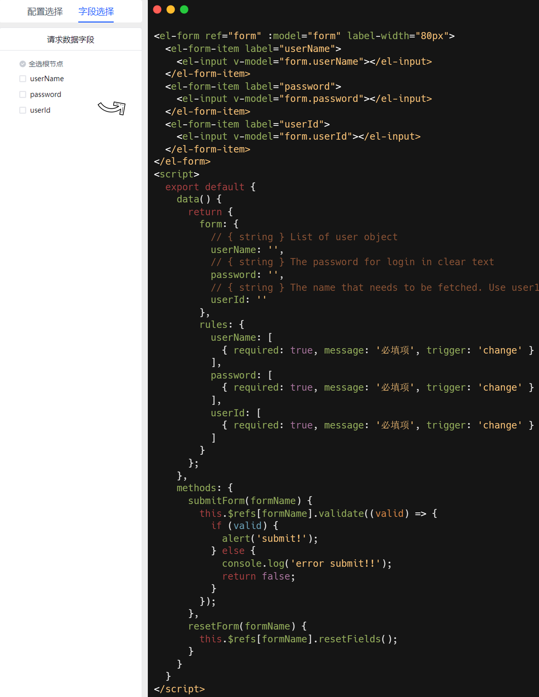

# 模板功能配置说明

* 模板功能的应用场景在于，重复性的表单或者表格页面，根据接口生成统一的代码模板。
* 模板功能是基于 @api-helper/core 实现，在 @api-helper/web + @api-helper/server 中应用。
可以直接访问[在线版本](https://web-apih.andou.live)。



## 本地部署模板服务
* 鼠标左键双击运行 `run-template-server.bat` 文件，当终端出现以下信息，代表启动成功。
* 浏览器输出 `http://localhost:3210` 即可访问。
```shell
[Nest] 12916  - 2023/03/14 17:40:08     LOG [NestFactory] Starting Nest application...
[Nest] 12916  - 2023/03/14 17:40:08     LOG [InstanceLoader] AppModule dependencies initialized +10ms
[Nest] 12916  - 2023/03/14 17:40:08     LOG [RoutesResolver] AppController {/}: +8ms
[Nest] 12916  - 2023/03/14 17:40:08     LOG [RouterExplorer] Mapped {/, GET} route +2ms
[Nest] 12916  - 2023/03/14 17:40:08     LOG [RouterExplorer] Mapped {/app/swagger/test, GET} route +1ms
[Nest] 12916  - 2023/03/14 17:40:08     LOG [RouterExplorer] Mapped {/app/swagger/docs, POST} route +1ms
[Nest] 12916  - 2023/03/14 17:40:08     LOG [NestApplication] Nest application successfully started +2ms
启动成功：http://localhost:3210
```
