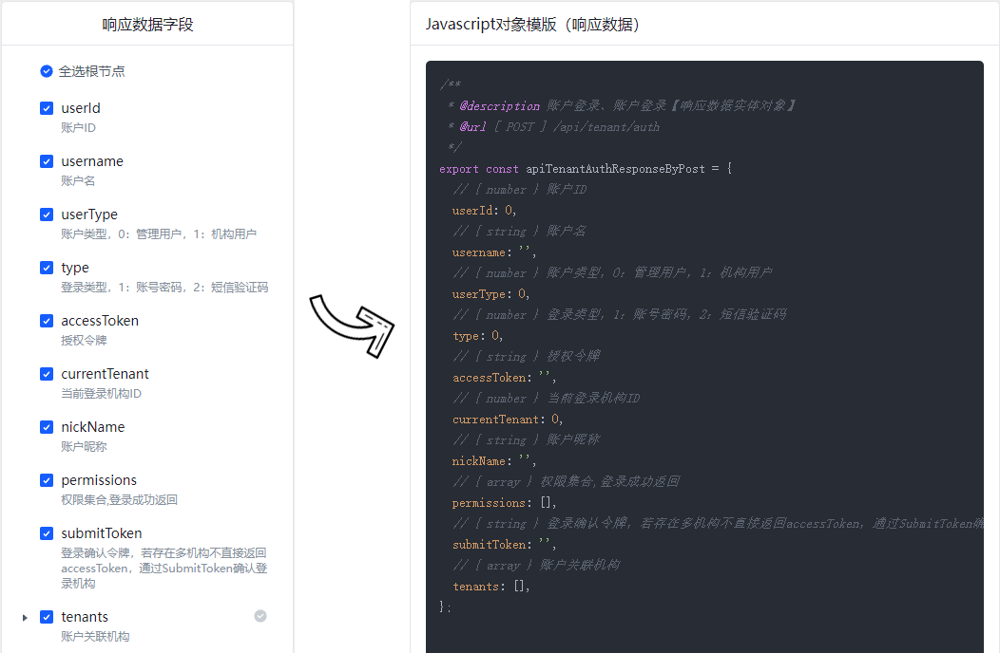
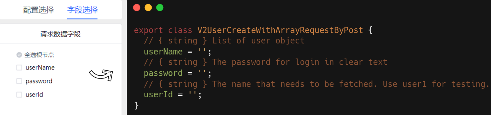
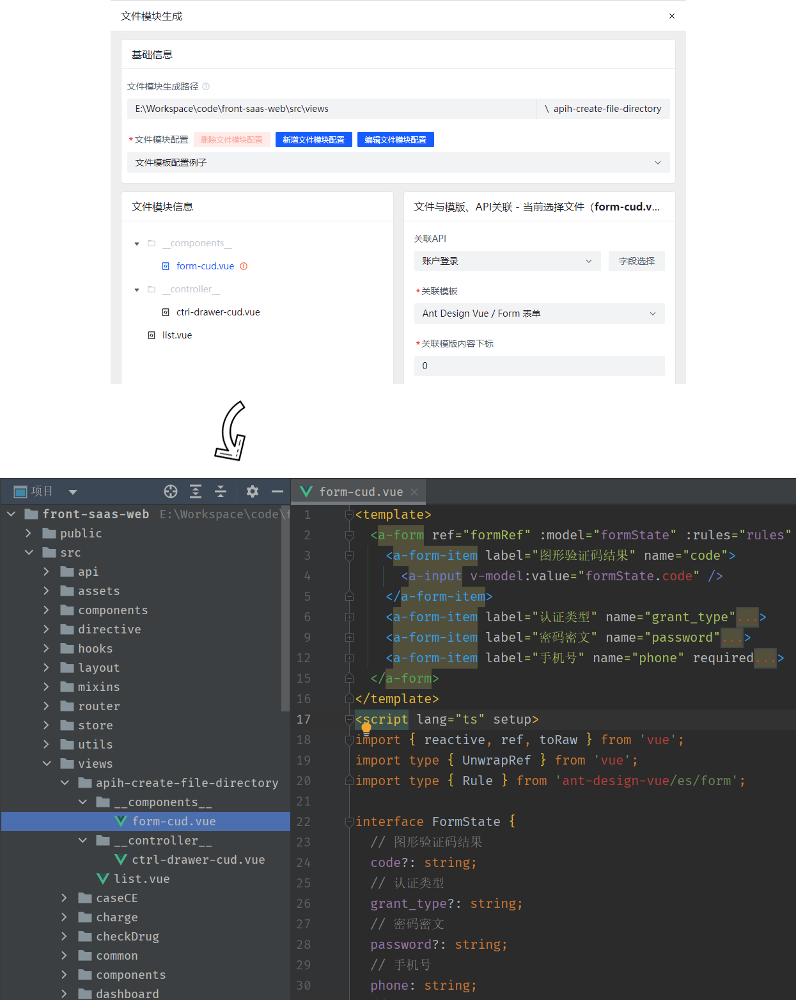

# 模板功能配置说明

* 模板功能的应用场景在于，重复性的表单或者表格页面，根据接口生成统一的代码模板。
* 模板功能本质上就是一个B/S架构的产物，需自行本地部署。可以直接访问[在线版本](https://web-apih.andou.live)。
  * 浏览器端代码在web包下。
  * 服务器端代码在server包下。

## 部署说明
windows环境，请先安装 `pnpm`，然后双击运行 `run-template-server.bat` 即可。下面是手动部署。

### 步骤1
打包浏览器代码，进入web包下，输入命令：`pnpm run build`。

### 步骤2
打包服务器端代码，进入server包下，输入命令：`pnpm run build`。

### 步骤3
启动服务，进入server包下，输入命令：`pnpm run start:prod`。服务器端会将浏览器web包下dist目录作为静态资源入口，服务启动之后，就能直接访问服务：[http://127.0.0.1:3210](http://127.0.0.1:3210)。

## 许可

[MIT](https://opensource.org/licenses/MIT) Copyright (c) 2023-present, [ztz2](https://github.com/ztz2)
