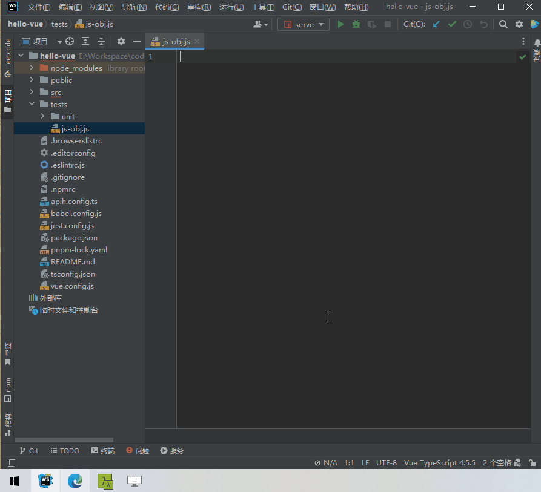

# 模板功能配置说明

* 模板功能的应用场景在于，重复性的表单或者表格页面，根据接口生成统一的代码模板。
* 模板功能本质上就是一个B/S架构的产物，需自行本地部署。可以直接访问[在线版本](https://web-apih.andou.live)。
  * 浏览器端代码在web包下。
  * 服务器端代码在server包下。

## 部署说明
windows环境，请先安装 `pnpm`，然后双击运行 `run-template-server.bat` 即可。下面是手动部署。

### 步骤1
打包浏览器端代码，进入web包下，输入命令：`pnpm run build`。

### 步骤2
打包服务器端代码，进入server包下，输入命令：`pnpm run build`。

### 步骤3
* 启动服务，进入server包下，输入命令：`pnpm run start:prod`。
* 服务启动后访问地址：[http://localhost:3210](http://localhost:3210)。
* 如果需要更新最新代码运行，需要从步骤1开始，后续启动服务操作，都是步骤3。

## 功能展示
* 通用的模版代码生成器
  * 生成JS对象代码
  * 生成Typescript interface代码
  * 生成实体类代码
  * 生成表单、表格代码
  * 自定义模版代码生成等

* 文件模块生成

将一个功能模块的接口和指定的模版关联，生成一个功能模块的文件代码。

## 许可

[MIT](https://opensource.org/licenses/MIT) Copyright (c) 2023-present, [ztz2](https://github.com/ztz2)
