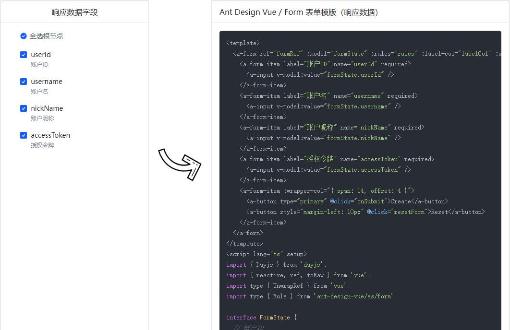

<h1
    style="background: -webkit-linear-gradient(315deg, rgb(255,87,34) 0%, #fee140 100%);
    background-clip: text;
    -webkit-background-clip: text;
    -webkit-text-fill-color: transparent"
>
    <a href="https://github.com/ztz2/api-helper" target="_blank">
        API Helper
    </a>
</h1>

    

* 模板功能的应用场景在于，重复性的表单或者表格页面，根据接口生成统一的代码模板。
* 模板功能本质上就是一个B/S架构的产物，需自行本地部署。
  * 浏览器端代码在web包下。
  * 服务器端代码在server包下。

## 部署说明
windows环境，请先安装 `pnpm`，然后双击运行 `run-template-server.bat` 即可。下面是手动部署。

### 步骤1
打包浏览器代码，进入web包下，输入命令：`pnpm run build`。

### 步骤2
打包服务器端代码，进入server包下，输入命令：`pnpm run build`。

### 步骤3
* 启动服务，进入server包下，输入命令：`pnpm run start:prod`。
* 服务启动后访问地址：[http://127.0.0.1:3210](http://127.0.0.1:3210)。
* 如果需要更新最新代码运行，需要从步骤1开始，后续启动服务操作，都是步骤3。

## 许可

[MIT](https://opensource.org/licenses/MIT) Copyright (c) 2023-present, [ztz2](https://github.com/ztz2)
